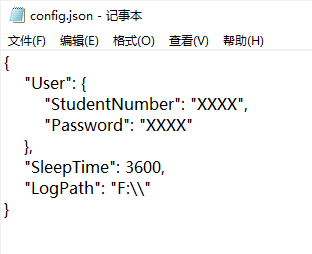
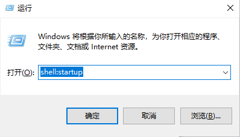
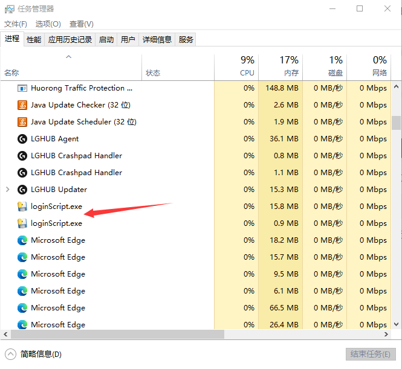

# 项目简介
在 :chicken: 大每次开机联网都要进行认证，这太麻烦了，所以这是一个专门为上海工程技术大学设计的自动登录校园网的脚本，设置成开机自启动后默认每个一个小时检查一等登录状态。这样就和连接普通网络没什么区别了。


# 项目结构

- img：README文件需要的图片

- build：打包临时目录，存放过程中的中间文件和临时文件
- dist：存放打包后的可执行文件
- config.json：配置JSON文件
- loginScript.py：源码
- loginScript.spec：配置打包过程的脚本文件


# 食用指北

1. 修改 ``config.json``

   - StudentNumber位置要输入学号
   - Password位置要输入密码
   - SleepTime表示检查登录状态的间隔时间，单位为秒
   - LogPath为日志路径

   

2. 将 ``config.json`` 复制到 ``dist`` 文件夹下

3. 创建 ``loginScript.exe`` 的快捷方式

4. ``cmd+R`` 输入 ``shell:startup`` 打开启动项文件

   

5. 将``loginScript.exe`` 的快捷方式复制到其中


# 项目运行状态

项目打包方法如下，运行脚本时不会出现Dos窗口。

```shell
pyinstaller -F .\loginScript.py -w
```

如果需要查看运行状态或关闭进程需要进入 ``任务管理器`` 找到 ``loginScript.exe`` 进程。




# 写在后面

部分情况需要用到原始的请求，在这里展示。

可以使用如Postman软件进行测试，都是Get请求。

如果失效可以自己抓包，记得开启 ``保留日志`` 跳转的网页请求会覆盖原始的登录认证请求。

- 登录认证

  ```http
  http://192.168.10.6/drcom/login?callback=dr1003&DDDDD=《《《StudentNumber》》》&upass=《《《Password》》》&0MKKey=123456&R1=0&R2=&R3=0&R6=0&para=00&v6ip=2001%3A0250%3A6009%3A0100%3A0078%3A0000%3A0000%3A01bc&terminal_type=1&lang=zh-cn&jsVersion=4.2.1&v=6227&lang=zh
  ```

- 退出登录

  ```http
  http://192.168.10.6:801/eportal/portal/logout?callback=dr1004&login_method=0&user_account=drcom&user_password=123&ac_logout=1&register_mode=1&wlan_user_ip=10.8.22.124&wlan_user_ipv6=&wlan_vlan_id=0&wlan_user_mac=000000000000&wlan_ac_ip=&wlan_ac_name=&jsVersion=4.2.1&v=7769&lang=zh
  ```
